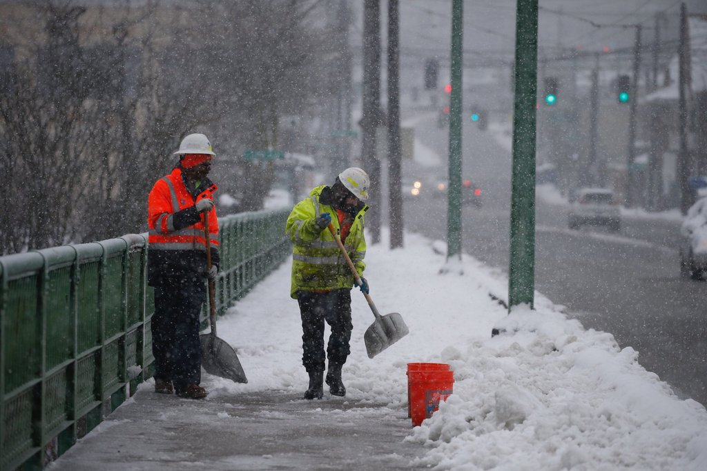

# Coldest Winter in Seattle?

_Seattle is welcoming for **more snow** this year. Department of Transportation in Seattle and Washington region are preparing for the heavy snow and forecasted cold winter. **Stay warm**!_

> Eighty thousand tons of salt, “tens of thousands” of tire chains and plenty of extra training and practice. Those are among the preparations underway at local transportation agencies in case of another major snowstorm this winter.
Officials from regional transportation, weather and emergency management agencies on Wednesday laid out their plans for potential snowstorms this winter, just months after record-breaking snow socked Seattle in February.
Meteorologists “don’t have a strong signal” of how winter weather will shape up this year, said Reid Wolcott, warning coordination meteorologist at the National Weather Service in Seattle.
>“So that means we need to be prepared for anything,” Wolcott said.

- [Source: How Seattle officials are planning for more snow this year](https://www.seattletimes.com/seattle-news/transportation/how-seattle-officials-are-planning-for-more-snow-this-year/)
- Other Sources:
	- [‘Dice may be loaded’ for November snow in Seattle](https://mynorthwest.com/1538194/dice-may-be-loaded-for-november-snow-in-seattle/)
	- [Winter Forecast for Seattle: Wet... or worse?](https://komonews.com/weather/scotts-weather-blog/winter-forecast-for-seattle-wet-or-worse)
	- [A Seattle Snowstorm Before Thanksgiving? It Could Happen](https://patch.com/washington/seattle/seattle-snowstorm-thanksgiving-it-could-happen)
